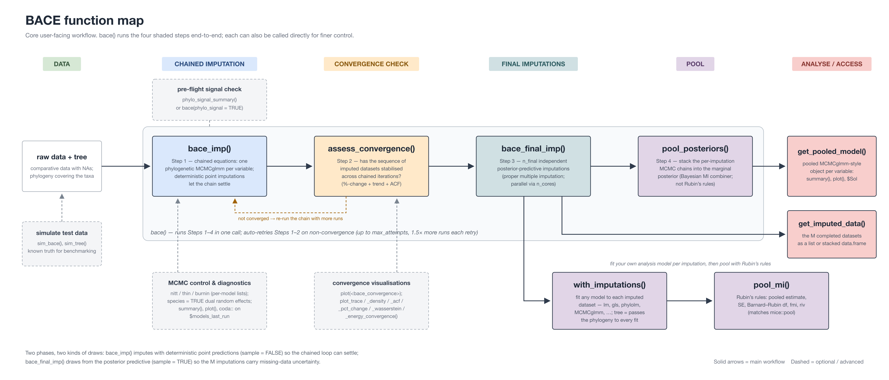

# Abstract

1. **Motivation:** *(2–3 sentences)* Missing data are pervasive in comparative datasets and standard *ad hoc* approaches (e.g., complete-case analyses, single imputation) can bias inference and underestimate uncertainty. Additionally, comparative traits are highly variable in nature (e.g., multinomial, ordered categorical, count and continuous traits). Many existing software cannot impute such traits limiting the use of imputation approaches in comparative biology.
2. **Method/software:** *(2–3 sentences)* We introduce **BACE**, an R package implementing **Bayesian Augmentation by Chained Equations** for phylogenetic comparative data, enabling imputation with phylogeny-informed covariance,  complex random-effect structures (e.g., species effects, random slopes) and mixed data types.
3. **Performance:** *(2–3 sentences)* Using simulations spanning phylogenetic signal, trait correlations, and missingness patterns, we evaluate imputation accuracy and inferential calibration, and compare BACE to leading alternatives (e.g., multilevel FCS-based tools).
4. **Availability:** *(1 sentence)* BACE is open-source with vignettes, reproducible workflows, and archived releases.

# Introduction

## Missing data in comparative biology: why it matters
- Trait databases + environmental covariates + phylogenies → systematic missingness (taxonomic, geographic, trait-type).
- Consequences: reduced power, compositional bias (which taxa remain), and overconfident inference if uncertainty is ignored.
- comparative data in conservation biology, macroecology, evolutionary biology, functional ecology. Used to inform theory, policy, and management.

## Why multiple imputation, and why *Bayesian* chained equations
- MI as uncertainty propagation (imputation as inference, not a preprocessing “fill”).
- Chained equations: flexible conditional models per variable; practical for mixed data types and modular model building.
- Bayesian approach: coherent uncertainty, hierarchical structure, prior regularisation, posterior predictive checks.

## Gap in current tooling (positioning)
- Existing MI tools handle multilevel/cross-classified structures only partially; nominal categorical + complex random effects often limited.
- Phylogeny-aware tools exist but are frequently oriented toward model-based prediction for continuous traits rather than general MI workflows.
- **BACE contribution:** MI for phylogenetic comparative data with multilevel structure + mixed data types (as supported), designed for downstream comparative analyses.

# Overview of the BACE framework

## Concept: Bayesian augmentation by chained equations
- Describe the iterative cycle (variable-by-variable conditional models).
- Emphasise “augmentation”: draw missing values from the posterior predictive distribution each cycle.

## Phylogenetic information in the imputation model
- How the tree enters (e.g., covariance among species; phylogenetic random effect).
- How this interacts with species-level random effects and other grouping structures.

## Supported data types and models (v1 scope)
*(Explicitly list what is supported in BACE v1 to avoid overclaiming.)*
- Continuous
- Binary
- Count
- Ordered categorical
- Unordered categorical (multinomial) *(if/when supported)*
- Missingness patterns handled (MCAR/MAR; sensitivity options if present)

> **Design choice box (optional):** When to use a joint-model vs chained equations; why BACE chooses chained equations.

# The BACE R package

## Inputs, outputs, and core workflow
- Inputs: data frame, species ID, phylogeny, optional predictors, grouping factors, priors, M (number of imputations / posterior draws).
- Outputs: imputed datasets (long/wide), posterior summaries, diagnostics, helper functions for pooling and downstream analysis.

## Typical user pipeline (pseudo-code)
```{r}
#| label: pipeline-pseudocode
#| echo: true
#| eval: false

# 1) Prepare data and tree (rows = taxa; factors declared; counts as integers)
# 2) Run the full workflow: chained imputation -> convergence check ->
#    n_final posterior-predictive imputations -> pooled posteriors
res <- bace(fixformula     = "y ~ x1 + x2",
            ran_phylo_form = "~ 1 | Species",
            phylo          = tree,
            data           = dat,
            runs           = 10, n_final = 50)

# 3) Diagnostics
plot(assess_convergence(res$initial_results))

# 4a) Bayesian route: pooled MCMCglmm posteriors
summary(get_pooled_model(res, "y"))

# 4b) Rubin's-rules route: any downstream model per imputed dataset
fits <- with_imputations(res, function(d) lm(y ~ x1 + x2, data = d))
pool_mi(fits)
```

## Convergence diagnostics
*(Structure only — content to write. See tutorial "Two kinds of convergence".)*
- Within-chain MCMC convergence of each per-variable model vs convergence of the chained-equations loop (the imputed-data sequence).
- `assess_convergence()` criteria (%-change + trend + ACF) and the `plot_*_convergence()` family.

## Pooling pathways: stacked posteriors and Rubin's rules
*(Structure only. Sources: `.agents/plans/pool_mi_rubin.md`; tutorial "Interpreting the pooled output"; Zhou & Reiter 2010; BDA3 Ch. 18.)*
- `pool_posteriors()`: stacking per-imputation chains approximates the marginal posterior; not Rubin's rules; O(1/M) difference at small M.
- `with_imputations()` + `pool_mi()`: model-agnostic Rubin's rules (Barnard–Rubin df, fmi/riv); matches `mice::pool` to machine precision.
- When to use which (variance components never via Rubin).

{#fig-function-map}

# Performance evaluation

## Simulation design
*(Structure only. Sources: `dev/12_recovery_simulation.R`, `dev/13_response_type_simulation.R`, `dev/simulation_results/SIMULATION_REPORT.qmd`; design details in `.agents/simulation-report.html`.)*
- Study A: parameter recovery (gaussian slope) under MCAR/MAR; oracle and complete-case comparators.
- Study B: five response types x MCAR/MAR; per-type accuracy/coverage metrics and their finite-draw/metric ceilings (`cover95_t`, prob-based sets, Bayes ceiling for categorical).

## Parameter recovery and inferential calibration (Study A)
<!-- TODO(authors): numbers in .agents/project-state.md "Re-validation" -
     MAR slope coverage 0.950, MCAR 0.975; complete-case MAR mean bias
     -0.259 vs BACE +0.011; CI width ratio. Figure candidate:
     dev/simulation_results/ figures. -->

## Imputation accuracy across response types (Study B)
<!-- TODO(authors): per-type table - recovery, coverage vs ceiling; pre/post
     bug-fix contrast if wanted (archive_2026-07_prebugfix). Numbers in
     .agents/project-state.md table. -->

```{r}
#| label: tbl-studyb
#| eval: false
# TODO(analysis): build the Study B summary table from
# dev/simulation_results/response_type_per_rep.csv (per-rep metrics).
```

## Benchmark against existing tools
*(Pending Track B3: missForest, Rphylopars, mice as feasible. Note: pigauto is a companion package, not a competitor — see `.agents/pigauto.md` for positioning.)*

# Worked example
*(Pending Track B4: AVONET at production MCMC settings; 300-species subset exists from the April benchmark.)*

# Discussion
*(Structure only.)*
- What BACE adds relative to existing MI and phylogenetic-prediction tools.
- Honest limitations <!-- TODO(authors): from .agents/project-state.md -
     poisson MAR t-interval 0.916 (log-link extrapolation; metric ceiling
     ~0.93-0.94 for skewed predictives), categorical sets slightly
     conservative (0.984), MNAR out of scope, runtime scaling. -->
- Practical guidance (pre-flight signal screening; when BACE is the wrong tool).
- Relationship to pigauto (division of labour).

# Availability and reproducibility
*(Structure only.)*
- Package: GitHub (daniel1noble/BACE), tutorial site, CRAN (pending).
- Simulation reproduction: `dev/12`, `dev/13`, `dev/14`, `SIMULATION_REPORT.qmd` (commands in `.agents/README.md`).

# Acknowledgements
*(To write.)*

# Author contributions
*(To write — CRediT.)*

# Data and code availability
*(To write.)*

# References

::: {#refs}
:::